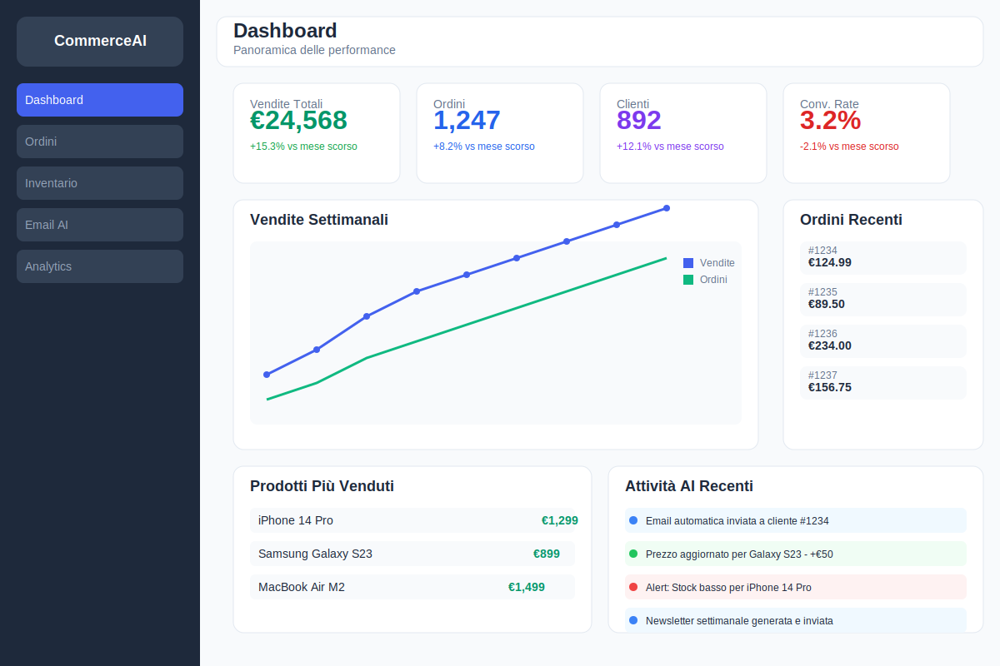

# CommerceAI Agent

Un sistema avanzato di agenti AI per l'automazione e l'ottimizzazione delle operazioni di e-commerce. CommerceAI Agent utilizza l'intelligenza artificiale per automatizzare e ottimizzare tutti gli aspetti della gestione di un negozio online, dalla gestione dell'inventario al pricing, dal servizio clienti al marketing.



## Caratteristiche Principali

### Architettura Moderna
- Protocollo MCP (Model Context Protocol) per l'integrazione con diversi LLM
- Multi-agenti specializzati (inventory, pricing, customer service, marketing)
- API RESTful e WebSocket per comunicazione real-time
- Container Docker per deployment facile

### Funzionalità Core
- **Gestione inventario intelligente**: Monitoraggio stock, previsioni domanda, riordini automatici
- **Pricing dinamico**: Algoritmi per ottimizzare prezzi in base a concorrenza e domanda
- **Customer service automatizzato**: Chat bot avanzato con gestione reclami e supporto
- **Marketing automatico**: Generazione descrizioni prodotti, SEO, campagne pubblicitarie
- **Controllo email completo**:
  - Risposta automatica ai clienti
  - Follow-up vendite
  - Gestione resi e rimborsi
  - Newsletter personalizzate

### Integrazioni
- Marketplace: Shopify, WooCommerce, Amazon, eBay
- Pagamenti: Stripe, PayPal
- CRM: HubSpot, Salesforce
- Spedizioni: DHL, UPS, FedEx

## Piani e Prezzi

### Piano Free
**€0/mese**
- 1 negozio
- Fino a 100 prodotti
- Fino a 100 ordini/mese
- Agenti AI base (esecuzione manuale)
- Dashboard e reportistica base
- Supporto email

### Piano Pro
**€49/mese**
- 3 negozi
- Fino a 1.000 prodotti
- Fino a 1.000 ordini/mese
- Agenti AI avanzati con esecuzione automatica
- Dashboard e reportistica avanzata
- Integrazioni con marketplace principali
- Supporto prioritario
- API access

### Piano Enterprise
**€199/mese**
- Negozi illimitati
- Prodotti illimitati
- Ordini illimitati
- Agenti AI personalizzati
- Dashboard e reportistica personalizzata
- Integrazioni con tutti i marketplace
- Supporto dedicato 24/7
- API access completo
- White-labeling

### Servizi Aggiuntivi
- **Onboarding personalizzato**: €299 una tantum
- **Sviluppo agenti AI custom**: a partire da €499
- **Integrazione marketplace custom**: a partire da €299
- **Consulenza e-commerce**: €150/ora

### Marketplace di Automazioni
Accedi al nostro marketplace di automazioni e template pre-costruiti:
- Workflow di automazione per specifici settori
- Template per email marketing
- Strategie di pricing pre-configurate
- Regole di gestione inventario ottimizzate

## Installazione e Configurazione

### Prerequisiti
- Node.js 16+ (per il frontend)
- Python 3.9+ (per il backend)
- Docker e Docker Compose (per il deployment)
- PostgreSQL (database)
- Redis (cache e code)

### Installazione Backend

```bash
# Clona il repository
git clone https://github.com/vinsblack/Commerce-Ai-Agent.git
cd commerce-ai-agent

# Crea e attiva un ambiente virtuale Python
python -m venv venv
source venv/bin/activate  # Su Windows: venv\Scripts\activate

# Installa le dipendenze backend
pip install -r requirements.txt

# Configura le variabili d'ambiente
cp .env.example .env
# Modifica il file .env con le tue configurazioni

# Inizializza il database
python -m src.db.init_db

# Avvia il backend in modalità sviluppo
uvicorn src.main:app --reload
```

### Installazione Frontend

```bash
# Naviga alla directory frontend
cd frontend

# Installa le dipendenze frontend
npm install

# Avvia il frontend in modalità sviluppo
npm start
```

### Deployment con Docker

```bash
# Costruisci e avvia tutti i servizi
docker-compose up -d

# Verifica lo stato dei container
docker-compose ps

# Visualizza i log
docker-compose logs -f
```

### Configurazione API Keys

Per utilizzare tutte le funzionalità di CommerceAI Agent, è necessario configurare le seguenti API keys:

1. **Integrazioni Marketplace**:
   - Shopify API Key e Secret
   - WooCommerce Consumer Key e Secret
   - Amazon MWS Access Key e Secret Key
   - eBay API Key

2. **Gateway di Pagamento**:
   - Stripe API Key
   - PayPal Client ID e Secret

3. **Servizi AI**:
   - OpenAI API Key (per gli agenti AI)
   - Google Cloud API Key (per analisi e previsioni)

Tutte queste chiavi possono essere configurate nella pagina Impostazioni > API dell'applicazione.

## Guida all'Utilizzo

### Dashboard
La dashboard fornisce una panoramica delle principali metriche del tuo e-commerce:
- Vendite giornaliere, settimanali e mensili
- Prodotti più venduti
- Ordini recenti
- Attività degli agenti AI

### Prodotti
Gestisci il tuo catalogo prodotti:
- Visualizza, aggiungi, modifica ed elimina prodotti
- Sincronizza prodotti con i marketplace integrati
- Ottimizza prezzi con l'agente AI dedicato
- Gestisci varianti, immagini e categorie

### Ordini
Gestisci gli ordini dei clienti:
- Visualizza e filtra ordini per stato, data e cliente
- Processa ordini e aggiorna lo stato
- Genera fatture e documenti di spedizione
- Analizza le tendenze degli ordini

### Clienti
Gestisci i tuoi clienti:
- Visualizza e filtra clienti
- Analizza lo storico acquisti
- Gestisci comunicazioni e preferenze
- Segmenta clienti per campagne marketing

### Negozi
Gestisci i tuoi negozi online:
- Integra negozi da diverse piattaforme (Shopify, WooCommerce, ecc.)
- Sincronizza prodotti, ordini e clienti
- Configura impostazioni specifiche per ogni negozio

### Integrazioni
Gestisci le integrazioni con servizi esterni:
- Marketplace (Shopify, WooCommerce, Amazon, eBay)
- Gateway di pagamento (Stripe, PayPal)
- Servizi di spedizione (DHL, UPS, FedEx)

### Agenti AI
Configura e gestisci gli agenti AI specializzati:
- **Agente Inventario**: Ottimizza livelli di stock e suggerisce riordini
- **Agente Pricing**: Analizza mercato e concorrenza per ottimizzare i prezzi
- **Agente Servizio Clienti**: Risponde automaticamente alle domande frequenti
- **Agente Marketing**: Genera contenuti e ottimizza campagne marketing

### Impostazioni
Configura le impostazioni dell'applicazione:
- Profilo utente e preferenze
- API keys e integrazioni
- Abbonamento e fatturazione
- Notifiche e automazioni

## Sviluppo

### Struttura del Progetto
```
commerce-ai-agent/
├── docs/                 # Documentazione
├── frontend/            # Frontend React
│   ├── public/          # Asset statici
│   └── src/             # Codice sorgente React
│       ├── components/  # Componenti riutilizzabili
│       ├── contexts/    # Context API
│       ├── pages/       # Pagine dell'applicazione
│       └── utils/       # Utility e helper
├── src/                 # Backend Python
│   ├── api/             # API endpoints
│   ├── db/              # Modelli database
│   ├── mcp/             # Model Context Protocol
│   ├── schemas/         # Pydantic schemas
│   ├── tasks/           # Task asincroni
│   └── utils/           # Utility e helper
├── tests/               # Test unitari e di integrazione
└── docker-compose.yml   # Configurazione Docker
```

### Contribuire al Progetto

1. Forka il repository
2. Crea un branch per la tua feature (`git checkout -b feature/amazing-feature main`)
3. Committa i tuoi cambiamenti (`git commit -m 'Aggiunta nuova feature'`)
4. Pusha al branch (`git push origin feature/amazing-feature`)
5. Apri una Pull Request

### Linee Guida per il Codice
- Segui PEP 8 per il codice Python
- Usa TypeScript per il codice frontend
- Scrivi test unitari per le nuove funzionalità
- Documenta il codice con docstring e commenti
- Usa il conventional commit format per i messaggi di commit

## Roadmap

### Prossime Funzionalità
- **Q2 2025**: Integrazione con marketplaces aggiuntivi (Etsy, Walmart)
- **Q3 2025**: App mobile per iOS e Android
- **Q3 2025**: Agente AI per ottimizzazione SEO
- **Q4 2025**: Integrazione con sistemi ERP (SAP, Oracle)
- **Q1 2026**: Supporto multi-lingua per gli agenti AI

## FAQ

**D: Posso utilizzare CommerceAI Agent con il mio negozio esistente?**
R: Sì, CommerceAI Agent si integra con i principali marketplace come Shopify, WooCommerce, Amazon e eBay.

**D: Come funzionano gli agenti AI?**
R: Gli agenti AI utilizzano modelli di linguaggio avanzati e algoritmi di machine learning per analizzare dati e automatizzare decisioni in diverse aree del tuo e-commerce.

**D: È necessario avere conoscenze tecniche per utilizzare CommerceAI Agent?**
R: No, l'interfaccia è intuitiva e user-friendly. Non sono richieste competenze di programmazione per l'utilizzo base.

**D: Posso passare da un piano all'altro?**
R: Sì, puoi aggiornare o declassare il tuo piano in qualsiasi momento. I cambiamenti saranno effettivi dal ciclo di fatturazione successivo.

**D: Come posso ottenere supporto?**
R: Offriamo supporto via email per tutti i piani, supporto prioritario per il piano Pro e supporto dedicato 24/7 per il piano Enterprise.

## Licenza
Questo progetto è distribuito con licenza dual:
- Versione Community: MIT License
- Versione Pro: Licenza Commerciale

  [](https://github.com/sponsors/vinsblack)


## Contatti
- **Email**: vincenzo.gallo77@hotmail.com

